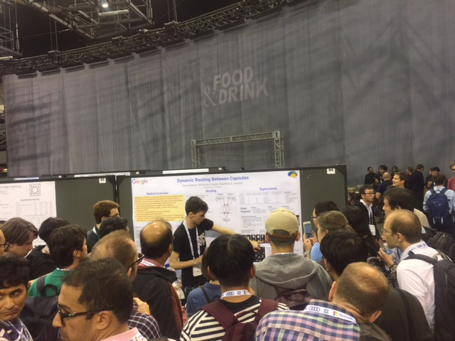

## CapsNets

### [Dynamic Routing Between Capsules](https://arxiv.org/abs/1710.09829)

[Sara Sabour](https://arxiv.org/find/cs/1/au:+Sabour_S/0/1/0/all/0/1), [Nicholas Frosst](https://arxiv.org/find/cs/1/au:+Frosst_N/0/1/0/all/0/1), [Geoffrey E Hinton](https://arxiv.org/find/cs/1/au:+Hinton_G/0/1/0/all/0/1)

(Submitted on 26 Oct 2017 ([v1](https://arxiv.org/abs/1710.09829v1)), last revised 7 Nov 2017 (this version, v2))

> A capsule is a group of neurons whose activity vector represents the instantiation parameters of a specific type of entity such as an object or an object part. We use the length of the activity vector to represent the probability that the entity exists and its orientation to represent the instantiation parameters. Active capsules at one level make predictions, via transformation matrices, for the instantiation parameters of higher-level capsules. When multiple predictions agree, a higher level capsule becomes active. We show that a discrimininatively trained, multi-layer capsule system achieves state-of-the-art performance on MNIST and is considerably better than a convolutional net at recognizing highly overlapping digits. To achieve these results we use an iterative routing-by-agreement mechanism: A lower-level capsule prefers to send its output to higher level capsules whose activity vectors have a big scalar product with the prediction coming from the lower-level capsule.

### Implementations

Tensorflow : https://github.com/naturomics/CapsNet-Tensorflow

PyTorch : https://github.com/gram-ai/capsule-networks

### Materials

[Aurélien Géron](https://www.youtube.com/channel/UCCvGd1WBMpFQ_vtC89VF2qA)

[Debarko De](https://hackernoon.com/@debarko?source=post_header_lockup)  ([Korean](https://www.nextobe.com/single-post/2017/11/02/CapsNetCapsule-Network))

[Sargur Srihari](http://www.cedar.buffalo.edu/~srihari/CSE676/9.12%20CapsuleNets.pdf)

[Tanay Kothari](https://towardsdatascience.com/uncovering-the-intuition-behind-capsule-networks-and-inverse-graphics-part-i-7412d121798d) 

### NIPS2017
